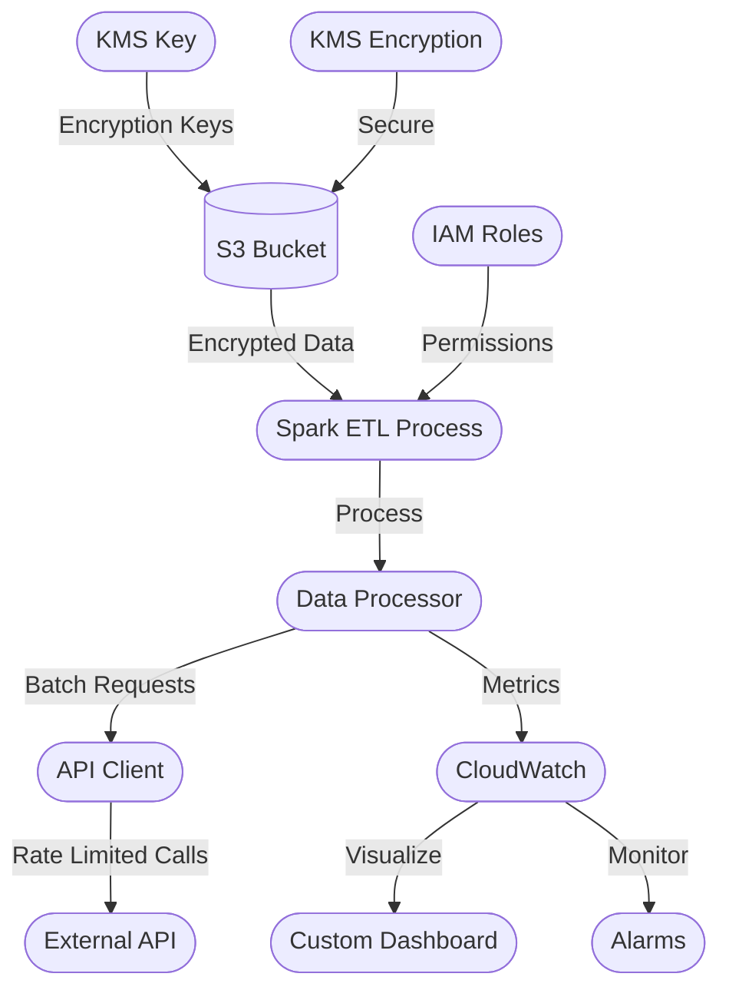
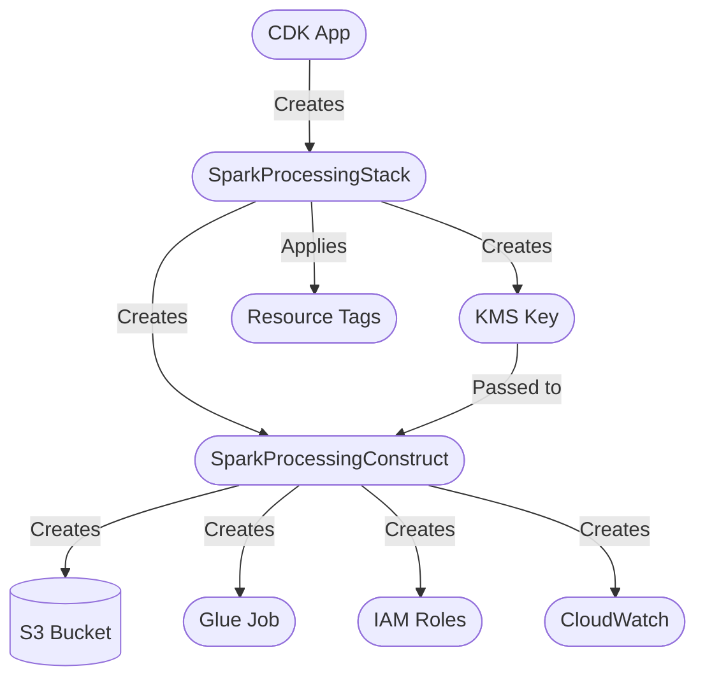
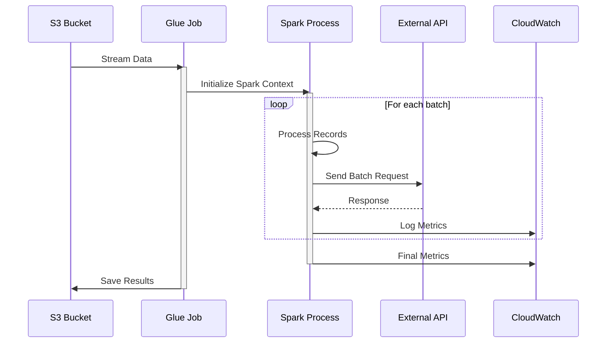
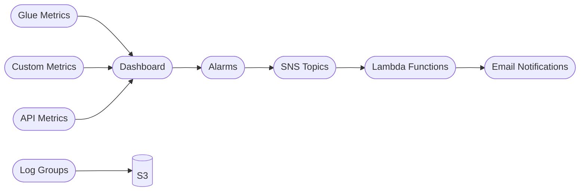

# Spark Processing with External API Integration in AWS Glue

A high-performance Python application designed to process large-scale data efficiently using both pandas and PySpark DataFrames. The system is optimized to handle 1 million records from S3 while maintaining strict API rate limits and optimizing resource usage. 

## Architecture Overview

### System Architecture



### CDK Construct Pattern



## Technical Details

### Infrastructure Components

#### 1. KMS Key Configuration
```typescript
// Stack level KMS key creation with detailed configuration
this.kmsKey = new kms.Key(this, 'EncryptionKey', {
  enableKeyRotation: true,
  description: `KMS key for ${props.glueJobName} Spark processing`,
  alias: `alias/spark-processing-${props.glueJobName}`,
  removalPolicy: cdk.RemovalPolicy.RETAIN,
  pendingWindow: cdk.Duration.days(7),
  enabled: true,
  policy: new iam.PolicyDocument({
    statements: [
      new iam.PolicyStatement({
        actions: ['kms:*'],
        principals: [new iam.AccountRootPrincipal()],
        resources: ['*'],
      }),
    ],
  }),
});
```

#### 2. S3 Bucket Configuration
```typescript
// Advanced S3 bucket configuration with security and lifecycle rules
this.bucket = new s3.Bucket(this, 'ProcessingBucket', {
  bucketName: props.bucketName,
  versioned: true,
  encryption: props.enableEncryption 
    ? s3.BucketEncryption.KMS
    : s3.BucketEncryption.S3_MANAGED,
  encryptionKey: props.kmsKey,
  blockPublicAccess: s3.BlockPublicAccess.BLOCK_ALL,
  removalPolicy: cdk.RemovalPolicy.RETAIN,
  lifecycleRules: [
    {
      id: 'CleanupOldVersions',
      enabled: true,
      noncurrentVersionExpiration: cdk.Duration.days(90),
      abortIncompleteMultipartUploadAfter: cdk.Duration.days(7),
    },
    {
      id: 'TransitionToIA',
      enabled: true,
      transitions: [
        {
          storageClass: s3.StorageClass.INFREQUENT_ACCESS,
          transitionAfter: cdk.Duration.days(30),
        },
        {
          storageClass: s3.StorageClass.GLACIER,
          transitionAfter: cdk.Duration.days(90),
        }
      ],
    }
  ],
  metrics: [
    {
      id: 'EntireBucket',
      prefix: '',
      tagFilters: {},
    }
  ],
  cors: [
    {
      allowedMethods: [s3.HttpMethods.GET, s3.HttpMethods.PUT, s3.HttpMethods.POST],
      allowedOrigins: ['*'],
      allowedHeaders: ['*'],
      maxAge: 3000,
    }
  ],
  serverAccessLogsPrefix: 'access-logs/',
  intelligentTieringConfigurations: [
    {
      name: 'OptimizeForInfrequentAccess',
      prefix: 'infrequent/',
      archiveAccessTierTime: cdk.Duration.days(90),
      deepArchiveAccessTierTime: cdk.Duration.days(180),
    }
  ]
});
```

#### 3. Glue Job IAM Role
```typescript
// Enhanced IAM role with detailed permissions
this.glueRole = new iam.Role(this, 'GlueJobRole', {
  assumedBy: new iam.ServicePrincipal('glue.amazonaws.com'),
  managedPolicies: [
    iam.ManagedPolicy.fromAwsManagedPolicyName('service-role/AWSGlueServiceRole'),
  ],
  inlinePolicies: {
    'CustomGlueJobPolicy': new iam.PolicyDocument({
      statements: [
        new iam.PolicyStatement({
          effect: iam.Effect.ALLOW,
          actions: [
            'cloudwatch:PutMetricData',
            'cloudwatch:GetMetricData',
            'logs:CreateLogGroup',
            'logs:CreateLogStream',
            'logs:PutLogEvents',
            'logs:DescribeLogStreams',
          ],
          resources: ['*'],
        }),
        new iam.PolicyStatement({
          effect: iam.Effect.ALLOW,
          actions: [
            's3:GetObject',
            's3:PutObject',
            's3:DeleteObject',
            's3:ListBucket',
          ],
          resources: [
            this.bucket.bucketArn,
            `${this.bucket.bucketArn}/*`,
          ],
        }),
      ],
    }),
  },
});
```

### Data Processing Flow



### Monitoring Architecture



## Advanced Configuration Options

### 1. Glue Job Configuration
```typescript
interface GlueJobConfig {
  maxConcurrentRuns: number;
  timeout: number;
  maxRetries: number;
  securityConfiguration: string;
  notifyDelayAfter: number;
  numberOfWorkers: number;
  workerType: string;
  glueVersion: string;
}

const defaultConfig: GlueJobConfig = {
  maxConcurrentRuns: 3,
  timeout: 2880,
  maxRetries: 2,
  securityConfiguration: 'GlueSecurityConfig',
  notifyDelayAfter: 24 * 60, // 24 hours
  numberOfWorkers: 10,
  workerType: 'G.1X',
  glueVersion: '4.0'
};
```

### 2. Monitoring Configuration
```typescript
interface MonitoringConfig {
  metricNamespace: string;
  dashboardName: string;
  alarmSnsTopicArn: string;
  evaluationPeriods: number;
  metricPeriod: number;
  thresholds: {
    failedTasks: number;
    memoryUtilization: number;
    processingTime: number;
  };
}

const defaultMonitoring: MonitoringConfig = {
  metricNamespace: 'SparkProcessing',
  dashboardName: 'SparkProcessingMetrics',
  alarmSnsTopicArn: 'arn:aws:sns:region:account:topic',
  evaluationPeriods: 2,
  metricPeriod: 300,
  thresholds: {
    failedTasks: 5,
    memoryUtilization: 85,
    processingTime: 3600
  }
};
```

## System Overview

The application implements a robust data processing pipeline that:
- Streams data from S3 in memory-efficient chunks
- Processes records using either pandas or PySpark based on data size and requirements
- Makes rate-limited API calls (5000 TPS) with circuit breaker protection
- Implements async processing for improved throughput
- Provides comprehensive monitoring and metrics collection
- Handles errors gracefully with automatic retries and failure tracking
- Scales efficiently with configurable batch sizes and worker counts

## Prerequisites

- Node.js 14.x or later
- AWS CDK CLI
- AWS credentials configured
- TypeScript 4.x or later

## Installation

1. Clone the repository:
```bash
git clone <repository-url>
cd spark_processing_external_api_in_glue
```

2. Install dependencies:
```bash
cd infrastructure
npm install
```

3. Create `.env` file in the infrastructure directory:
```bash
# AWS Credentials
AWS_ACCESS_KEY_ID=your_access_key_here
AWS_SECRET_ACCESS_KEY=your_secret_key_here
AWS_REGION=your_region_here
AWS_ACCOUNT_ID=your_account_id_here

# Environment
ENVIRONMENT=development
```

## Deployment

1. Bootstrap CDK (first time only):
```bash
cdk bootstrap
```

2. Build the TypeScript code:
```bash
npm run build
```

3. Deploy the stack:
```bash
cdk deploy
```

## Configuration

The infrastructure can be configured through `bin/app.ts`:

```typescript
new SparkProcessingStack(app, 'SparkProcessingStack', {
  env: awsConfig.env,
  bucketName: `spark-processing-${awsConfig.env.account}-${awsConfig.env.region}`,
  glueJobName: 'spark-processing-job',
  glueJobScript: 's3://spark-processing-${awsConfig.env.account}-${awsConfig.env.region}/scripts/processor.py',
  glueWorkerType: 'G.1X',
  glueNumberOfWorkers: 10,
  glueTimeout: 2880,
  enableEncryption: true,
  enableMetrics: true,
  customMetrics: [
    'glue.driver.aggregate.shuffleLocalBytesRead',
    'glue.driver.aggregate.shuffleRemoteBytesRead'
  ],
  alarmThresholds: {
    failedTasks: 5,
    memoryUtilization: 85,
    processingTime: 3600
  }
});
```

## Recent Changes

1. **KMS Key Creation:**
   - Moved KMS key creation to Stack level for proper scope
   - Added KMS key rotation
   - Implemented key permissions for Glue job

2. **S3 Bucket Naming:**
   - Updated bucket naming to include account ID and region
   - Ensures global uniqueness across AWS accounts
   - Format: `spark-processing-{account-id}-{region}`

3. **Glue Job Configuration:**
   - Updated Python version to 3 (from 3.9)
   - Added enhanced monitoring options
   - Implemented auto-scaling configuration

4. **Security Enhancements:**
   - Added bucket encryption configuration
   - Implemented strict IAM policies
   - Added CloudWatch logging

## Monitoring

The infrastructure creates a CloudWatch dashboard with:

1. Job Execution Metrics:
   - Completed tasks
   - Failed tasks

2. Resource Utilization:
   - JVM heap usage
   - CPU system load

3. Data Processing Metrics:
   - S3 read/write bytes
   - Custom metrics (if configured)

## Alarms

Configurable alarms for:

1. Failed Tasks:
   - Triggers when failed tasks exceed threshold
   - 5-minute evaluation period

2. Memory Utilization:
   - Triggers when JVM heap usage exceeds threshold
   - 10-minute evaluation period

3. Processing Time:
   - Triggers when job runtime exceeds threshold
   - 5-minute evaluation period

## Cleanup

To remove the infrastructure:

```bash
cdk destroy
```

Note: The S3 bucket will be retained by default to prevent accidental data loss. To delete it, change the `removalPolicy` in the construct.

## Features

- Memory-efficient S3 file streaming
- Rate-limited API calls (5000 TPS)
- Async processing with aiohttp
- Support for both pandas and PySpark DataFrames
- Progress tracking with tqdm
- Comprehensive logging and metrics collection
- Resource optimization
- Error handling and retries
- Performance monitoring and analytics

## Requirements

- Python 3.8+
- AWS credentials configured
- Access to target API endpoint
- Apache Spark (optional, for PySpark usage)
- Minimum 4GB RAM recommended
- Stable internet connection for API calls

## Configuration

Create a `.env` file with the following variables:

```env
# Required
S3_BUCKET=your-bucket-name
S3_KEY=path/to/your/file.csv
API_ENDPOINT=https://your-api-endpoint.com/process

# Optional
BATCH_SIZE=1000
MAX_WORKERS=20
RATE_LIMIT_CALLS=5000
RATE_LIMIT_PERIOD=1
CHUNK_SIZE=8192
LOG_LEVEL=INFO
```

## Testing

### 1. Local Testing Setup

The project now includes a complete local testing environment with:

```bash
# Start the local testing environment
docker-compose up --build

# Run tests in the container
docker-compose exec spark pytest tests/test_local.py -v

# Generate test data
docker-compose exec spark python scripts/generate_test_data.py --records 1000
```

### 2. Test Data Management

The system now includes automated test data handling:
- Automatic test bucket creation in LocalStack
- Sample record generation with realistic data
- Automatic cleanup after test completion
- Configurable test data size and characteristics

### 3. Integration Testing

Enhanced integration testing capabilities:
```bash
# Test with LocalStack S3
pytest tests/test_integration.py --s3-endpoint=http://localstack:4566

# Test with mock API
pytest tests/test_integration.py --mock-api

# Full end-to-end test
pytest tests/test_integration.py --no-mock
```

### 4. Unit Tests

Run the unit test suite:
```bash
# Run all tests
pytest tests/

# Run specific test file
pytest tests/test_processor.py

# Run with coverage report
pytest --cov=src tests/
```

### 5. Performance Tests

Test performance metrics and scalability:
```bash
# Run performance tests
pytest tests/test_performance_metrics.py

# Test with different batch sizes
BATCH_SIZE=500 pytest tests/test_performance_metrics.py
BATCH_SIZE=2000 pytest tests/test_performance_metrics.py
```

## Performance Optimization

### 1. Local Testing Performance
- Optimized memory settings for local testing
- Configured proper parallelism for test environment
- Implemented efficient test data handling
- Added performance monitoring in tests

### 2. Spark Configuration
The system now includes detailed Spark configuration for both testing and production:

```python
spark_conf = {
    # Memory Configuration
    "spark.memory.fraction": "0.8",
    "spark.memory.storageFraction": "0.3",
    "spark.memory.offHeap.enabled": "true",
    "spark.memory.offHeap.size": "10g",
    
    # Execution Configuration
    "spark.default.parallelism": "200",
    "spark.sql.shuffle.partitions": "200",
    "spark.speculation": "true",
    
    # Dynamic Allocation
    "spark.dynamicAllocation.enabled": "true",
    "spark.dynamicAllocation.minExecutors": "2",
    "spark.dynamicAllocation.maxExecutors": "20"
}
```

## Development Workflow

### 1. Local Development
```bash
# Start local environment
docker-compose up -d

# Access Spark UI
open http://localhost:4040

# Monitor LocalStack
open http://localhost:4566

# Run tests
docker-compose exec spark pytest tests/

# Clean up
docker-compose down -v
```

### 2. Test Data Management
```bash
# Generate test data
docker-compose exec spark python scripts/generate_test_data.py --records 1000

# Verify test data
docker-compose exec spark python scripts/verify_test_data.py

# Clean test data
docker-compose exec spark python scripts/cleanup_test_data.py
```

## Monitoring and Debugging

### 1. Local Testing Logs
- Spark logs available in `/app/logs`
- LocalStack logs accessible via Docker
- Test execution logs with detailed output
- Performance metrics collection

### 2. Test Metrics
The system now collects comprehensive test metrics:
- Processing speed and throughput
- Memory utilization
- API call patterns
- Error rates and types
- Resource usage statistics