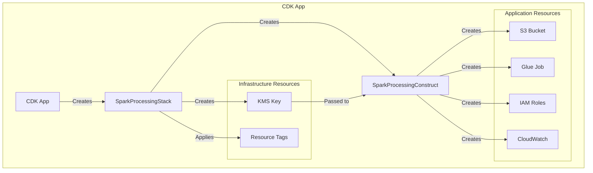
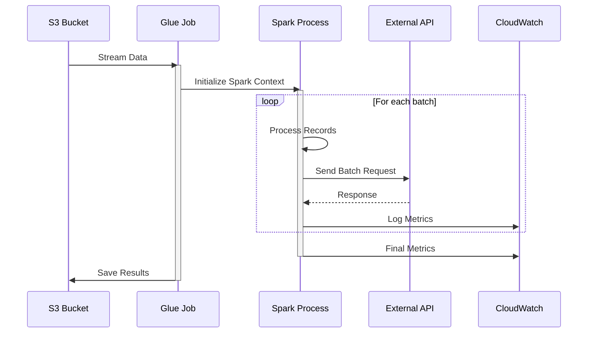
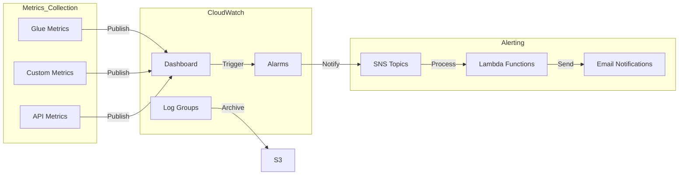
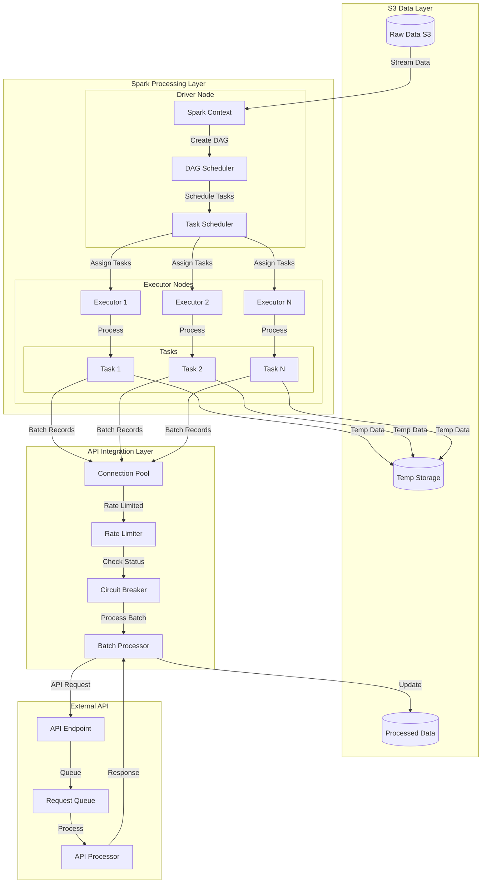

# Spark Processing with External API Integration in AWS Glue

A high-performance Python application designed to process large-scale data efficiently using both pandas and PySpark DataFrames. The system is optimized to handle 1 million records from S3 while maintaining strict API rate limits and optimizing resource usage. 

## Architecture Overview

### System Architecture

```mermaid
graph TB
    subgraph AWS Cloud
        S3[(S3 Bucket)]
        KMS[KMS Key]
        
        subgraph Glue Job
            SparkETL[Spark ETL Process]
            DataProcessor[Data Processor]
            APIClient[API Client]
        end
        
        subgraph Monitoring
            CW[CloudWatch]
            Dashboard[Custom Dashboard]
            Alarms[Alarms]
        end
        
        subgraph Security
            IAM[IAM Roles]
            Encryption[KMS Encryption]
        end
    end
    
    subgraph External
        API[External API]
    end
    
    S3 -->|Encrypted Data| SparkETL
    KMS -->|Encryption Keys| S3
    SparkETL -->|Process| DataProcessor
    DataProcessor -->|Batch Requests| APIClient
    APIClient -->|Rate Limited Calls| API
    DataProcessor -->|Metrics| CW
    CW -->|Visualize| Dashboard
    CW -->|Monitor| Alarms
    IAM -->|Permissions| Glue Job
    Encryption -->|Secure| S3
```

### CDK Construct Pattern



## Technical Details

### Infrastructure Components

#### 1. KMS Key Configuration
```typescript
// Stack level KMS key creation with detailed configuration
this.kmsKey = new kms.Key(this, 'EncryptionKey', {
  enableKeyRotation: true,
  description: `KMS key for ${props.glueJobName} Spark processing`,
  alias: `alias/spark-processing-${props.glueJobName}`,
  removalPolicy: cdk.RemovalPolicy.RETAIN,
  pendingWindow: cdk.Duration.days(7),
  enabled: true,
  policy: new iam.PolicyDocument({
    statements: [
      new iam.PolicyStatement({
        actions: ['kms:*'],
        principals: [new iam.AccountRootPrincipal()],
        resources: ['*'],
      }),
    ],
  }),
});
```

#### 2. S3 Bucket Configuration
```typescript
// Advanced S3 bucket configuration with security and lifecycle rules
this.bucket = new s3.Bucket(this, 'ProcessingBucket', {
  bucketName: props.bucketName,
  versioned: true,
  encryption: props.enableEncryption 
    ? s3.BucketEncryption.KMS
    : s3.BucketEncryption.S3_MANAGED,
  encryptionKey: props.kmsKey,
  blockPublicAccess: s3.BlockPublicAccess.BLOCK_ALL,
  removalPolicy: cdk.RemovalPolicy.RETAIN,
  lifecycleRules: [
    {
      id: 'CleanupOldVersions',
      enabled: true,
      noncurrentVersionExpiration: cdk.Duration.days(90),
      abortIncompleteMultipartUploadAfter: cdk.Duration.days(7),
    },
    {
      id: 'TransitionToIA',
      enabled: true,
      transitions: [
        {
          storageClass: s3.StorageClass.INFREQUENT_ACCESS,
          transitionAfter: cdk.Duration.days(30),
        },
        {
          storageClass: s3.StorageClass.GLACIER,
          transitionAfter: cdk.Duration.days(90),
        }
      ],
    }
  ],
  metrics: [
    {
      id: 'EntireBucket',
      prefix: '',
      tagFilters: {},
    }
  ],
  cors: [
    {
      allowedMethods: [s3.HttpMethods.GET, s3.HttpMethods.PUT, s3.HttpMethods.POST],
      allowedOrigins: ['*'],
      allowedHeaders: ['*'],
      maxAge: 3000,
    }
  ],
  serverAccessLogsPrefix: 'access-logs/',
  intelligentTieringConfigurations: [
    {
      name: 'OptimizeForInfrequentAccess',
      prefix: 'infrequent/',
      archiveAccessTierTime: cdk.Duration.days(90),
      deepArchiveAccessTierTime: cdk.Duration.days(180),
    }
  ]
});
```

#### 3. Glue Job IAM Role
```typescript
// Enhanced IAM role with detailed permissions
this.glueRole = new iam.Role(this, 'GlueJobRole', {
  assumedBy: new iam.ServicePrincipal('glue.amazonaws.com'),
  managedPolicies: [
    iam.ManagedPolicy.fromAwsManagedPolicyName('service-role/AWSGlueServiceRole'),
  ],
  inlinePolicies: {
    'CustomGlueJobPolicy': new iam.PolicyDocument({
      statements: [
        new iam.PolicyStatement({
          effect: iam.Effect.ALLOW,
          actions: [
            'cloudwatch:PutMetricData',
            'cloudwatch:GetMetricData',
            'logs:CreateLogGroup',
            'logs:CreateLogStream',
            'logs:PutLogEvents',
            'logs:DescribeLogStreams',
          ],
          resources: ['*'],
        }),
        new iam.PolicyStatement({
          effect: iam.Effect.ALLOW,
          actions: [
            's3:GetObject',
            's3:PutObject',
            's3:DeleteObject',
            's3:ListBucket',
          ],
          resources: [
            this.bucket.bucketArn,
            `${this.bucket.bucketArn}/*`,
          ],
        }),
      ],
    }),
  },
});
```

### Data Processing Flow



### Monitoring Architecture



## Advanced Configuration Options

### 1. Glue Job Configuration
```typescript
interface GlueJobConfig {
  maxConcurrentRuns: number;
  timeout: number;
  maxRetries: number;
  securityConfiguration: string;
  notifyDelayAfter: number;
  numberOfWorkers: number;
  workerType: string;
  glueVersion: string;
}

const defaultConfig: GlueJobConfig = {
  maxConcurrentRuns: 3,
  timeout: 2880,
  maxRetries: 2,
  securityConfiguration: 'GlueSecurityConfig',
  notifyDelayAfter: 24 * 60, // 24 hours
  numberOfWorkers: 10,
  workerType: 'G.1X',
  glueVersion: '4.0'
};
```

### 2. Monitoring Configuration
```typescript
interface MonitoringConfig {
  metricNamespace: string;
  dashboardName: string;
  alarmSnsTopicArn: string;
  evaluationPeriods: number;
  metricPeriod: number;
  thresholds: {
    failedTasks: number;
    memoryUtilization: number;
    processingTime: number;
  };
}

const defaultMonitoring: MonitoringConfig = {
  metricNamespace: 'SparkProcessing',
  dashboardName: 'SparkProcessingMetrics',
  alarmSnsTopicArn: 'arn:aws:sns:region:account:topic',
  evaluationPeriods: 2,
  metricPeriod: 300,
  thresholds: {
    failedTasks: 5,
    memoryUtilization: 85,
    processingTime: 3600
  }
};
```

## System Overview

The application implements a robust data processing pipeline that:
- Streams data from S3 in memory-efficient chunks
- Processes records using either pandas or PySpark based on data size and requirements
- Makes rate-limited API calls (5000 TPS) with circuit breaker protection
- Implements async processing for improved throughput
- Provides comprehensive monitoring and metrics collection
- Handles errors gracefully with automatic retries and failure tracking
- Scales efficiently with configurable batch sizes and worker counts

## Prerequisites

- Node.js 14.x or later
- AWS CDK CLI
- AWS credentials configured
- TypeScript 4.x or later

## Installation

1. Clone the repository:
```bash
git clone <repository-url>
cd spark_processing_external_api_in_glue
```

2. Install dependencies:
```bash
cd infrastructure
npm install
```

3. Create `.env` file in the infrastructure directory:
```bash
# AWS Credentials
AWS_ACCESS_KEY_ID=your_access_key_here
AWS_SECRET_ACCESS_KEY=your_secret_key_here
AWS_REGION=your_region_here
AWS_ACCOUNT_ID=your_account_id_here

# Environment
ENVIRONMENT=development
```

## Deployment

1. Bootstrap CDK (first time only):
```bash
cdk bootstrap
```

2. Build the TypeScript code:
```bash
npm run build
```

3. Deploy the stack:
```bash
cdk deploy
```

## Configuration

The infrastructure can be configured through `bin/app.ts`:

```typescript
new SparkProcessingStack(app, 'SparkProcessingStack', {
  env: awsConfig.env,
  bucketName: `spark-processing-${awsConfig.env.account}-${awsConfig.env.region}`,
  glueJobName: 'spark-processing-job',
  glueJobScript: 's3://spark-processing-${awsConfig.env.account}-${awsConfig.env.region}/scripts/processor.py',
  glueWorkerType: 'G.1X',
  glueNumberOfWorkers: 10,
  glueTimeout: 2880,
  enableEncryption: true,
  enableMetrics: true,
  customMetrics: [
    'glue.driver.aggregate.shuffleLocalBytesRead',
    'glue.driver.aggregate.shuffleRemoteBytesRead'
  ],
  alarmThresholds: {
    failedTasks: 5,
    memoryUtilization: 85,
    processingTime: 3600
  }
});
```

## Recent Changes

1. **KMS Key Creation:**
   - Moved KMS key creation to Stack level for proper scope
   - Added KMS key rotation
   - Implemented key permissions for Glue job

2. **S3 Bucket Naming:**
   - Updated bucket naming to include account ID and region
   - Ensures global uniqueness across AWS accounts
   - Format: `spark-processing-{account-id}-{region}`

3. **Glue Job Configuration:**
   - Updated Python version to 3 (from 3.9)
   - Added enhanced monitoring options
   - Implemented auto-scaling configuration

4. **Security Enhancements:**
   - Added bucket encryption configuration
   - Implemented strict IAM policies
   - Added CloudWatch logging

## Monitoring

The infrastructure creates a CloudWatch dashboard with:

1. Job Execution Metrics:
   - Completed tasks
   - Failed tasks

2. Resource Utilization:
   - JVM heap usage
   - CPU system load

3. Data Processing Metrics:
   - S3 read/write bytes
   - Custom metrics (if configured)

## Alarms

Configurable alarms for:

1. Failed Tasks:
   - Triggers when failed tasks exceed threshold
   - 5-minute evaluation period

2. Memory Utilization:
   - Triggers when JVM heap usage exceeds threshold
   - 10-minute evaluation period

3. Processing Time:
   - Triggers when job runtime exceeds threshold
   - 5-minute evaluation period

## Cleanup

To remove the infrastructure:

```bash
cdk destroy
```

Note: The S3 bucket will be retained by default to prevent accidental data loss. To delete it, change the `removalPolicy` in the construct.

## Features

- Memory-efficient S3 file streaming
- Rate-limited API calls (5000 TPS)
- Async processing with aiohttp
- Support for both pandas and PySpark DataFrames
- Progress tracking with tqdm
- Comprehensive logging and metrics collection
- Resource optimization
- Error handling and retries
- Performance monitoring and analytics

## Requirements

- Python 3.8+
- AWS credentials configured
- Access to target API endpoint
- Apache Spark (optional, for PySpark usage)
- Minimum 4GB RAM recommended
- Stable internet connection for API calls

## Configuration

Create a `.env` file with the following variables:

```env
# Required
S3_BUCKET=your-bucket-name
S3_KEY=path/to/your/file.csv
API_ENDPOINT=https://your-api-endpoint.com/process

# Optional
BATCH_SIZE=1000
MAX_WORKERS=20
RATE_LIMIT_CALLS=5000
RATE_LIMIT_PERIOD=1
CHUNK_SIZE=8192
LOG_LEVEL=INFO
```

## Testing

### 1. Unit Tests

Run the unit test suite:
```bash
# Run all tests
pytest tests/

# Run specific test file
pytest tests/test_processor.py

# Run with coverage report
pytest --cov=src tests/
```

### 2. Performance Tests

Test performance metrics and scalability:
```bash
# Run performance tests
pytest tests/test_performance_metrics.py

# Test with different batch sizes
BATCH_SIZE=500 pytest tests/test_performance_metrics.py
BATCH_SIZE=2000 pytest tests/test_performance_metrics.py
```

### 3. Integration Tests

Test the complete processing pipeline:
```bash
# Run integration tests
pytest tests/test_integration.py

# Test with mock API
pytest tests/test_integration.py --mock-api
```

### 4. Load Testing

Test system behavior under load:
```bash
# Test with 100k records
pytest tests/test_performance_metrics.py --num-records=100000

# Test with maximum load (1M records)
pytest tests/test_performance_metrics.py --num-records=1000000
```

### 5. API Integration Testing

Test API connectivity and rate limiting:
```bash
# Test API health check
pytest tests/test_api_client.py -k test_health_check

# Test rate limiting
pytest tests/test_api_client.py -k test_rate_limiting
```

### 6. Error Handling Tests

Verify error handling capabilities:
```bash
# Test retry mechanism
pytest tests/test_processor.py -k test_retry_mechanism

# Test circuit breaker
pytest tests/test_processor.py -k test_circuit_breaker
```

### Test Data Generation

Generate test data for local testing:
```bash
# Generate sample data
python scripts/generate_test_data.py --records 1000

# Generate data with specific characteristics
python scripts/generate_test_data.py --records 1000 --error-rate 0.1 --batch-size 100
```

## Usage

Run the processor:

```bash
# Basic usage
python src/processor.py

# With specific configuration
BATCH_SIZE=500 MAX_WORKERS=10 python src/processor.py

# With detailed logging
LOG_LEVEL=DEBUG python src/processor.py
```

## Architecture

The system is built with the following components:

### Data Processing
- Supports both pandas and PySpark DataFrames
- Streams S3 data for memory efficiency
- Processes records in configurable batches
- Async processing with aiohttp for improved throughput

### Performance Features
- Adaptive rate limiting
- Circuit breaker pattern for API resilience
- Performance prediction and anomaly detection
- Real-time analytics and insights
- Telemetry collection

### Monitoring and Metrics
- Real-time progress tracking
- Detailed performance metrics
- API health monitoring
- Resource utilization tracking
- Error rate monitoring

## Performance Optimization

The application is optimized for:

### Memory Usage
- Streams S3 data instead of loading entire file
- Uses bounded queue for producer-consumer pattern
- Processes records in configurable batches
- Efficient garbage collection

### CPU Utilization
- Async I/O for network operations
- Batch processing to reduce overhead
- Efficient data structures
- Session reuse for API calls

### Network Optimization
- Adaptive rate limiting
- Connection pooling
- Circuit breaker pattern
- Batch processing of records

## Monitoring

- Real-time progress bar shows processing status
- Detailed logging to both console and file
- Processing statistics including:
  - Total records processed
  - Error count
  - Duration
  - Average processing speed
  - API response times
  - Resource utilization

## Logs

Logs are stored in the `logs` directory:
- `processor.log`: Contains detailed processing information
- `api_client.log`: API interaction logs and metrics

## Error Handling

- Circuit breaker for API failure protection
- Automatic retry with exponential backoff
- Error logging with stack traces
- Graceful shutdown on interruption
- Failed record tracking
- Anomaly detection for performance issues

## Performance Metrics

The system collects and reports:
- Processing throughput
- API response times
- Error rates
- Resource utilization
- Batch processing statistics
- Performance anomalies

## Troubleshooting

Common issues and solutions:

### API Rate Limiting
If encountering rate limit errors:
1. Check current rate limit settings in .env
2. Monitor api_client.log for rate limit patterns
3. Adjust BATCH_SIZE and MAX_WORKERS accordingly

### Memory Usage
If experiencing memory issues:
1. Reduce BATCH_SIZE in .env
2. Monitor process memory usage in logs
3. Consider enabling garbage collection logging

### Processing Speed
To optimize processing speed:
1. Experiment with different BATCH_SIZE values
2. Monitor CPU usage and adjust MAX_WORKERS
3. Check network latency to API endpoint

### Error Handling
When encountering errors:
1. Check logs/processor.log for error details
2. Verify API endpoint health
3. Review circuit breaker status in metrics

## Spark Processing Architecture

### High-Level Processing Flow



### Detailed Technical Specifications

#### 1. Spark Configuration and Optimization

```python
# Spark Configuration for Optimal Performance
spark_conf = {
    # Memory Configuration
    "spark.memory.fraction": "0.8",  # Fraction of heap space used for execution and storage
    "spark.memory.storageFraction": "0.3",  # Amount of storage memory immune to eviction
    "spark.memory.offHeap.enabled": "true",  # Enable off-heap memory
    "spark.memory.offHeap.size": "10g",  # Off-heap memory size
    
    # Execution Configuration
    "spark.default.parallelism": "200",  # Default number of partitions
    "spark.sql.shuffle.partitions": "200",  # Number of partitions for shuffling
    "spark.speculation": "true",  # Enable speculative execution
    "spark.speculation.multiplier": "1.5",  # Speculative execution threshold
    
    # Network Configuration
    "spark.network.timeout": "800s",  # Default network timeout
    "spark.rpc.message.maxSize": "1024",  # Maximum message size
    
    # Serialization
    "spark.serializer": "org.apache.spark.serializer.KryoSerializer",
    "spark.kryoserializer.buffer.max": "2047m",
    
    # Dynamic Allocation
    "spark.dynamicAllocation.enabled": "true",
    "spark.dynamicAllocation.minExecutors": "2",
    "spark.dynamicAllocation.maxExecutors": "20",
    "spark.dynamicAllocation.executorIdleTimeout": "60s",
    
    # I/O Configuration
    "spark.hadoop.mapreduce.fileoutputcommitter.algorithm.version": "2",
    "spark.hadoop.mapreduce.fileoutputcommitter.cleanup-failures.ignored": "true",
    
    # SQL Configuration
    "spark.sql.adaptive.enabled": "true",
    "spark.sql.adaptive.coalescePartitions.enabled": "true",
    "spark.sql.adaptive.skewJoin.enabled": "true"
}
```

#### 2. Data Processing Pipeline

```python
class SparkProcessor:
    def __init__(self, spark_session, config):
        self.spark = spark_session
        self.config = config
        self.metrics = ProcessingMetrics()
        
    def process_data(self, input_path: str) -> DataFrame:
        # Read data with optimized configuration
        df = (self.spark.read
              .option("inferSchema", "false")  # Use defined schema for better performance
              .option("maxFilesPerTrigger", 10)  # Control batch size
              .option("cleanSource", "archive")  # Archive processed files
              .schema(self.get_schema())
              .json(input_path))
        
        # Optimize partitioning
        num_partitions = self.calculate_optimal_partitions(df)
        df = df.repartition(num_partitions)
        
        # Apply transformations
        return (df.transform(self.preprocess_data)
                .transform(self.enrich_data)
                .transform(self.validate_data))
    
    def calculate_optimal_partitions(self, df: DataFrame) -> int:
        # Calculate based on data size and available resources
        total_size = df.count()
        executor_cores = self.spark.conf.get("spark.executor.cores")
        return min(max(total_size // self.config.records_per_partition, 
                      executor_cores * 2), 
                  self.config.max_partitions)

    @udf(returnType=StringType())
    def enrich_data(self, df: DataFrame) -> DataFrame:
        # Add computed columns and enrich data
        return df.withColumn("processed_timestamp", current_timestamp())
                .withColumn("batch_id", monotonically_increasing_id())
```

#### 3. API Integration Layer

```python
class APIIntegration:
    def __init__(self, config: APIConfig):
        self.config = config
        self.connection_pool = aiohttp.ClientSession(
            connector=aiohttp.TCPConnector(
                limit=config.max_connections,
                ttl_dns_cache=300,
                use_dns_cache=True
            ),
            timeout=aiohttp.ClientTimeout(
                total=config.timeout_total,
                connect=config.timeout_connect,
                sock_read=config.timeout_read
            ),
            headers=self.get_default_headers()
        )
        self.rate_limiter = AsyncRateLimiter(
            rate_limit=config.rate_limit,
            time_window=config.rate_window
        )
        self.circuit_breaker = CircuitBreaker(
            failure_threshold=config.failure_threshold,
            recovery_timeout=config.recovery_timeout,
            expected_exceptions=config.retry_exceptions
        )
        
    async def process_batch(self, records: List[Dict]) -> List[Dict]:
        async with self.rate_limiter:
            try:
                return await self.circuit_breaker.call(
                    self._send_batch_request,
                    records
                )
            except CircuitBreakerError:
                self.metrics.record_circuit_breaker_trip()
                return self.handle_circuit_breaker_fallback(records)
    
    async def _send_batch_request(self, records: List[Dict]) -> List[Dict]:
        async with self.connection_pool.post(
            self.config.endpoint,
            json={"records": records},
            headers=self.get_request_headers()
        ) as response:
            if response.status == 429:  # Rate limit exceeded
                retry_after = int(response.headers.get("Retry-After", 1))
                raise RateLimitExceeded(retry_after)
            response.raise_for_status()
            return await response.json()
```

#### 4. Performance Optimization Techniques

1. **Memory Management**
```python
class MemoryManager:
    def __init__(self):
        self.batch_queue = deque(maxlen=1000)
        self.memory_threshold = 0.85  # 85% memory utilization threshold
        
    def monitor_memory(self):
        memory_usage = psutil.Process().memory_percent()
        if memory_usage > self.memory_threshold:
            self.trigger_memory_optimization()
    
    def trigger_memory_optimization(self):
        # Clear cache if memory pressure is high
        self.spark.catalog.clearCache()
        gc.collect()  # Force garbage collection
```

2. **Batch Processing Optimization**
```python
class BatchOptimizer:
    def __init__(self, config: BatchConfig):
        self.config = config
        self.batch_stats = []
        
    def optimize_batch_size(self) -> int:
        # Dynamic batch size based on processing metrics
        avg_processing_time = statistics.mean(self.batch_stats)
        if avg_processing_time > self.config.target_processing_time:
            return max(self.config.batch_size // 2, 
                      self.config.min_batch_size)
        return min(self.config.batch_size * 2, 
                  self.config.max_batch_size)
```

3. **Network Optimization**
```python
class NetworkOptimizer:
    def __init__(self, config: NetworkConfig):
        self.config = config
        self.connection_pool = ConnectionPool(
            max_size=config.max_connections,
            max_retries=config.max_retries,
            backoff_factor=config.backoff_factor
        )
        
    async def optimize_concurrent_requests(self):
        # Adjust concurrent requests based on latency
        avg_latency = await self.measure_api_latency()
        max_concurrent = min(
            self.config.max_connections,
            int(self.config.target_throughput * avg_latency)
        )
        return max_concurrent
```